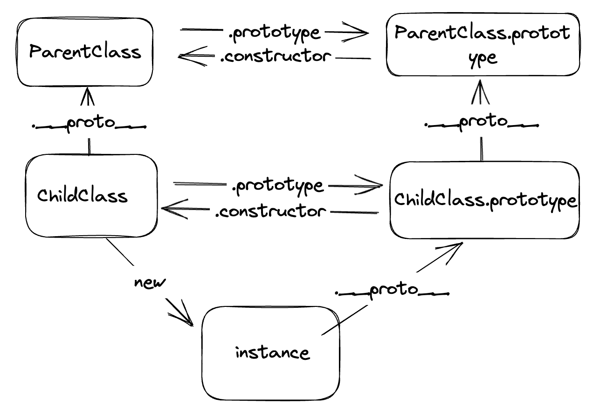

### 类和构造函数的不同点

-   类内部的方法和属性不可枚举

```js
class Point {
    key = 1;
    fn() {}
}
// []
console.log(Object.keys(Point.prototype));

function Point(x, y) {}
Point.prototype.test = function () {};
// ['test']
console.log(Object.keys(Point.prototype));
```

-   类必须通过 new 来调用，es5 中普通函数可通过函数调用

```js
class Point {}
// TypeError: Class constructor Point cannot be invoked without 'new'
Point();
```

-   类中有私有属性和私有方法（通过在前面加`#`来标记），且私有属性无法被子类继承。
-   类的变量提升行为和 let，const 保持一致，定义前使用会抛出错误（[Hoisting](https://developer.mozilla.org/en-US/docs/Glossary/Hoisting)）

### 关于类的继承

-   子类的构造函数中必须要先调用 super()，否则会报错。
    为什么子类的构造函数，一定要调用 super()？原因就在于 ES6 的继承机制，与 ES5 完全不同。ES5 的继承机制，是先创造一个独立的子类的实例对象，然后再将父类的方法添加到这个对象上面，即“实例在前，继承在后”。ES6 的继承机制，则是先将父类的属性和方法，加到一个空的对象上面，然后再将该对象作为子类的实例，即“继承在前，实例在后”。这就是为什么 ES6 的继承必须先调用 super()方法，因为这一步会生成一个继承父类的 this 对象，没有这一步就无法继承父类。
-   类的原型对象不可修改

```js
class Point {
    parent() {
        console.log('parent');
    }
}

/*
{
  value: {},
  writable: false,
  enumerable: false,
  configurable: false
}
*/
console.log(Object.getOwnPropertyDescriptor(Point, 'prototype'));
```

其实很好理解，类的方法都是定义在原型对象上的，如果原型对象可修改那就意味着写在类中的方法就无法被子类正常继承了，这就很迷惑。

-   类继承的实质
    

```js
class A {}

class B {}

// B 的实例继承 A 的实例
Object.setPrototypeOf(B.prototype, A.prototype);

// B 继承 A 的静态属性
Object.setPrototypeOf(B, A);

const b = new B();
```
