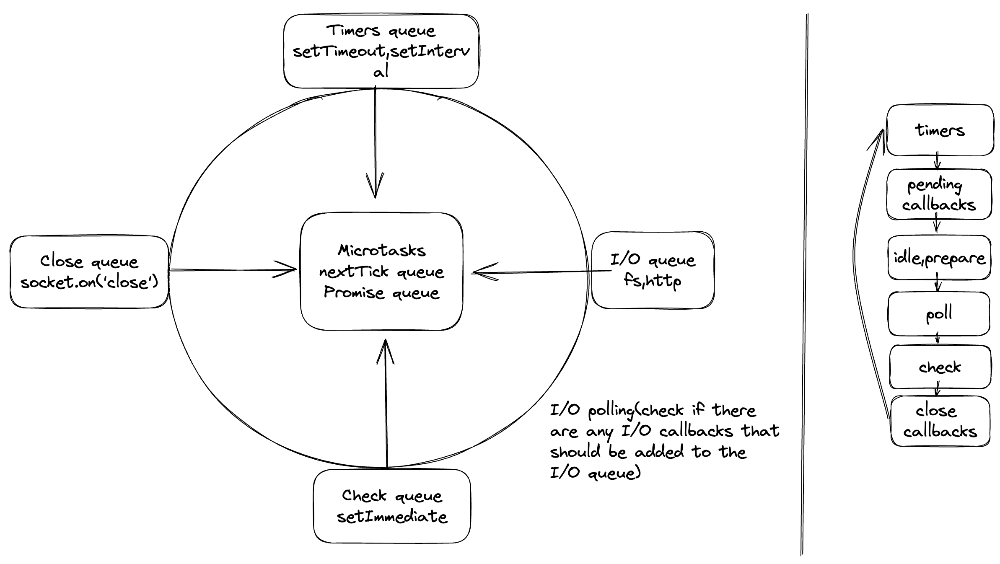

[Visual guide to nodejs event loop](https://www.builder.io/blog/visual-guide-to-nodejs-event-loop)
[Non-deterministic order of execution of setTimeout vs setImmediate](https://codeburst.io/understanding-non-deterministic-order-of-execution-of-settimeout-vs-setimmediate-in-node-js-49e8d5956cab)

### overview

### the sequence of execution

- Any callbacks in the microtask queue are executed. First, tasks in the nextTick queue and only then tasks in the promise queue.
- All callbacks within the timer queue are executed.
- Callbacks in the microtask queue (if present) are executed after every callback in the timer queue. First, tasks in the nextTick queue, and then tasks in the promise queue.
- All callbacks within the I/O queue are executed.
- Callbacks in the microtask queues (if present) are executed, starting with nextTickQueue and then Promise queue.
- All callbacks in the check queue are executed.
- Callbacks in the microtask queues (if present) are executed after every callback in the check queue. First, tasks in the nextTick queue, and then tasks in the promise queue.
- All callbacks in the close queue are executed.
- For one final time in the same loop, the microtask queues are executed. First, tasks in the nextTick queue, and then tasks in the promise queue.
