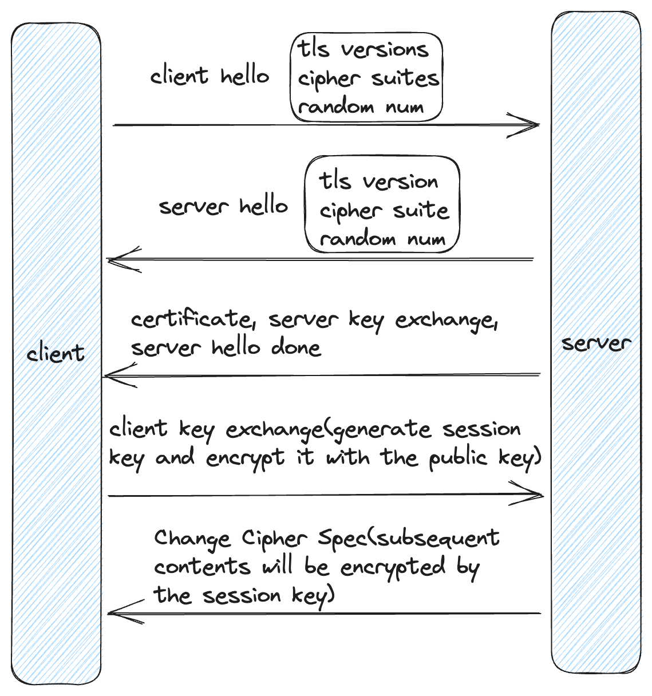

### 客户端如何校验证书

1. 服务端在 SSL/TLS 握手过程中将其证书发送给客户端。
2. 客户端通过使用受信任的证书颁发机构（CA）的公钥验证证书的数字签名，来检查证书是否由受信任的 CA 签名。
3. 客户端通过将当前日期与证书的有效期进行比较，来检查证书是否仍然有效。
4. 客户端检查证书中的域名是否与其连接的服务器的域名匹配，以防止中间人攻击。
5. 客户端通过检查证书吊销列表（CRL）或使用在线证书状态协议（OCSP）来检查证书是否已被吊销。

如果其中任何一项检查失败，客户端将向用户显示警告或错误消息，指示服务端证书无效或不受信任。客户端还可能终止与服务器的连接，以防止进一步的通信。

### 参考资料

https://www.linuxbabe.com/security/ssltls-handshake-process-explained-with-wireshark-screenshot

https://www.bilibili.com/video/BV1j64y1973t/?spm_id_from=333.788.top_right_bar_window_history.content.click&vd_source=7b242528b70c1c6d4ee0ca3780b547a5
